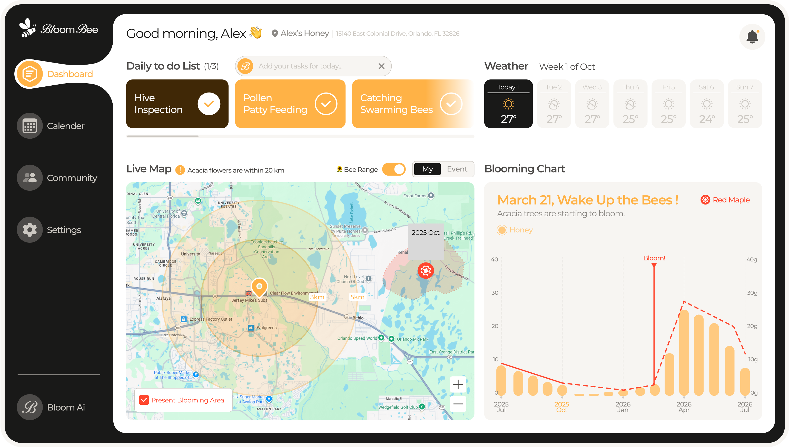
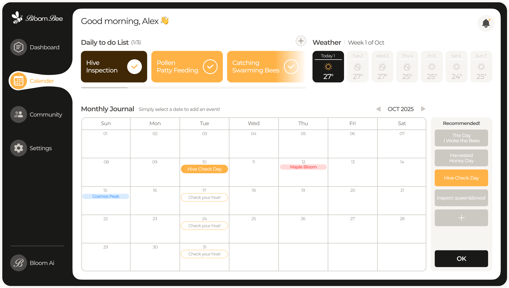
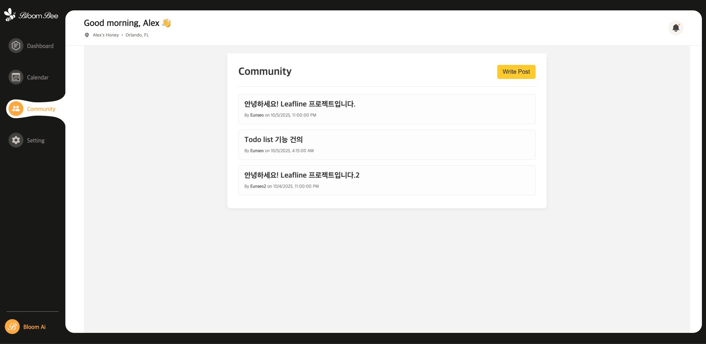
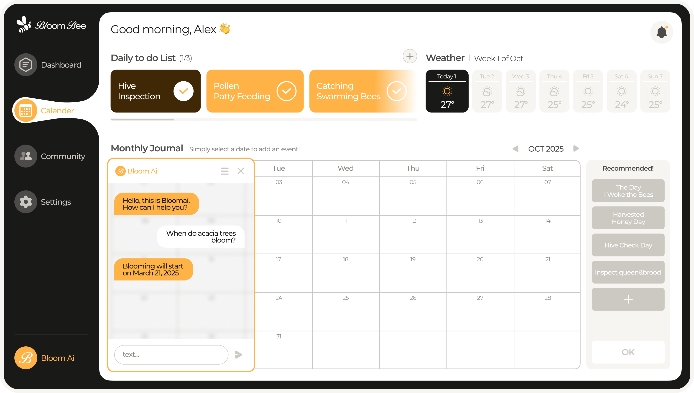

# 🐝 Bloom Bee

<div align="center">
    <a href="https://www.bloombee.garden/">
        
    </a>
</div>

<p align="center">
  <b>양봉업자를 위한 AI 기반 개화 예측 및 꿀 수확량 관리 서비스</b>
  <br/>
  <a href="https://www.bloombee.garden/"><strong>Visit Bloom Bee »</strong></a>
</p>

---

## 💡 프로젝트 소개 (Inspiration)

저희 LEAFLINE 팀은 "BloomWatch: An Earth Observation Application for Global Flowering Phenology"라는 주제를 탐구하며 지구의 개화 현상에 깊은 관심을 갖게 되었습니다. 이 과정에서 최근 심각한 문제로 대두된 **집단 벌 실종(Colony Collapse Disorder)** 현상과 기후 변화로 인한 **개화 시기 예측 실패**가 양봉 농가에 큰 어려움을 준다는 사실을 알게 되었습니다.

**Bloom Bee**는 이러한 문제에 주목하여, 양봉업자분들이 보다 안정적이고 효율적으로 양봉업을 운영할 수 있도록 돕기 위해 탄생한 서비스입니다.

## ✨ 주요 기능 (Features)

Bloom Bee는 양봉업자분들의 성공적인 양봉 활동을 돕기 위해 다음과 같은 핵심 기능들을 제공합니다.

### 🏡 대시보드 (Dashboard)

<br/>
홈 화면인 대시보드에서는 양봉 관리에 필요한 모든 정보를 한눈에 파악할 수 있습니다.

- **오늘의 할 일 (To-Do List)**: 매일 처리해야 할 작업을 관리합니다. 추가 버튼을 눌러 직접 할 일을 입력하거나, 'B' 버튼을 눌러 AI의 추천을 받을 수 있습니다.
- **날씨 정보**: 양봉 활동에 중요한 현재 및 주간 날씨 정보를 제공합니다.
- **라이브 맵 (Live Map)**:
    - **내 양봉장 위치와 벌의 활동 반경**: 지도 위에 사용자의 양봉장과 벌들의 예상 활동 범위를 표시해 효율적인 관리를 돕습니다.
    - **개화 지역 (Blooming Area)**: 주변에 꽃이 만개한 지역을 표시하여 채밀 계획 수립에 도움을 줍니다.
- **개화 및 꿀 생산량 차트**: 특정 꽃의 만개 시기와 정도, 그리고 그에 따른 예상 꿀 생산량을 그래프로 시각화하여 제공합니다.

### 📅 AI 캘린더 (AI Calendar)

<br/>
AI 캘린더는 월별, 일별 작업을 체계적으로 계획하고 관리할 수 있도록 돕습니다.

- **AI 월별 추천 할 일**: 캘린더에서 날짜를 선택하면 사이드바에 해당 월에 추천되는 작업 목록이 나타납니다.
- **지능형 작업 추천**: 사용자가 특정 작업을 등록하면, AI가 "3일 후 벌통 확인하기"와 같이 연관된 후속 작업을 추천합니다. 사용자가 확인하고 클릭하면 해당 작업이 자동으로 캘린더에 추가됩니다.

### 👨‍👩‍👧‍👦 커뮤니티 (Community)

<br/>
다른 양봉업자들과 소중한 정보와 경험을 나눌 수 있는 공간입니다.

- **익명 게시판**: 누구나 자유롭게 글을 작성하고 양봉에 대한 팁과 노하우를 공유하며 함께 성장할 수 있습니다.

### 🤖 AI 챗봇 (AI Chatbot)

<br/>
양봉에 대해 궁금한 점이 있다면 언제든지 AI 챗봇에게 물어보세요.

- **맞춤형 정보 제공**: 챗봇은 사용자가 가입 시 입력한 정보, 현재의 To-Do 리스트, 대시보드 상태 등을 종합적으로 파악하여 사용자에게 가장 필요한 맞춤형 답변과 정보를 제공합니다.
- **다양한 정보**: 양봉 기술, 꿀벌 생태, 질병 관리 등 양봉에 관한 모든 것을 질문하고 답변을 얻을 수 있습니다.

## 🛠️ 기술 스택 (Tech Stack)

### Core


### ML / AI


### Deployment


## 📂 프로젝트 구조

```
/
├── BackEnd/      # FastAPI 기반 백엔드 서버
│   ├── app/
│   └── tests/
└── Frontend/     # Vanilla JS 기반 프론트엔드
    ├── css/
    ├── js/
    ├── pages/
    └── index.html
```

## 🧑‍💻 팀 LEAFLINE

| 역할 | 이름 | GitHub |
| :--- | :--- | :--- |
| 👨‍💻 **Backend & PO** | 홍기현 | [@CodeBBackGoSu](https://github.com/CodeBBackGoSu) |
| 👩‍💻 **Backend** | 조은서 | [@theeunseojo](https://github.com/theeunseojo) |
| 🎨 **Frontend** | 오유성 | [@Emma10003](https://github.com/Emma10003) |
| 🎨 **Frontend** | 은영 | [@euny802](https://github.com/euny802) |
| 🎨 **Designer** | 방태림 | qkd232071@gmail.com |
| 📊 **Data Analyst & Modeling** | 윤세휘 | [@thw-hwistle](https://github.com/thw-hwistle) |

## 🚀 실행 방법 (How to Run)

프로젝트를 로컬 환경에서 실행하는 방법은 다음과 같습니다.

### Backend (FastAPI)

1.  **Gemini API 키 설정**
    `BackEnd/app/core/config.py` 파일 내의 `GEMINI_API_KEY` 값을 자신의 API 키로 변경해야 합니다.

    ```python
    # BackEnd/app/core/config.py

    class Settings(BaseSettings):
        # ...
        # Gemini AI
        GEMINI_API_KEY: str = "YOUR_GEMINI_API_KEY" # <--- 이 부분을 수정하세요
        # ...
    ```

2.  **의존성 설치**
    `BackEnd` 디렉토리로 이동하여 `uv`를 사용해 필요한 라이브러리를 설치합니다.
    ```bash
    cd BackEnd
    uv sync
    ```

3.  **가상 환경 실행 및 서버 구동**
    `BackEnd` 디렉토리에서 다음 명령어를 차례대로 실행하여 가상 환경을 활성화하고 FastAPI 서버를 시작합니다.
    ```bash
    # 가상 환경 활성화 (macOS/Linux)
    source .venv/bin/activate

    # 가상 환경 활성화 (Windows)
    # .venv\Scripts\activate

    # 서버 실행
    uvicorn app.main:app --reload --host 0.0.0.0 --port 8000
    ```
    서버가 정상적으로 실행되면 `http://127.0.0.1:8000`에서 API 문서를 확인할 수 있습니다.

#### ✅ Swagger UI / OpenAPI 스펙 확인

- Swagger UI: `http://127.0.0.1:8000/docs`
- OpenAPI JSON: `http://127.0.0.1:8000/openapi.json`

### Frontend (JavaScript)

프론트엔드 코드는 별도의 빌드 과정 없이 브라우저에서 바로 실행할 수 있습니다.

1.  **Live Server 실행**
    VS Code와 같은 코드 에디터에서 `Frontend` 폴더를 엽니다.
2.  `index.html` 파일을 마우스 오른쪽 버튼으로 클릭하고, `Open with Live Server`를 선택하여 실행합니다.
3.  Live Server가 실행되면 웹 브라우저에서 자동으로 페이지가 열립니다.

---

## 🧠 ML(머신러닝) 기능 추가 & AI POC 구성

본 리팩토링에서는 **모델 학습(train) → 모델 아티팩트 저장(joblib) → API 서빙(inference) → 프론트 대시보드 연동**까지를 한 흐름으로 구성하여, "AI POC" 형태로 재현 가능하게 만들었습니다.

### 1) 학습(Training)

1. `BackEnd/ml/data.csv` 준비
   - 최소 컬럼 예시: `month`, `species`, `honey_amount`
2. 학습 스크립트 실행

```bash
cd BackEnd
uv run python ml/train.py
```

3. 모델 파일 생성 확인
   - 기본 경로 예시: `BackEnd/app/ml/artifacts/bloom_honey_model.joblib`

### 2) 예측 API(Inference)

예측 엔드포인트 예시:

- `POST /api/ml/predict-honey`

요청/응답 예시:

```json
// Request
{ "month": 4, "species": "acacia" }

// Response
{ "month": 4, "species": "acacia", "predicted_honey_amount": 123.45 }
```

> 모델 파일이 없으면 500 에러가 발생할 수 있으므로, 배포/실행 전에 학습을 먼저 수행해 주세요.

---

## 🐳 Docker로 백엔드 실행하기 (로컬/배포 공통)

### 1) Dockerfile 준비

`BackEnd/Dockerfile`을 추가하여, FastAPI 서버를 컨테이너로 실행할 수 있도록 구성했습니다.

### 2) 빌드/실행

```bash
cd BackEnd
docker build -t bloombee-backend .
docker run --rm -p 8000:8000 bloombee-backend
```

실행 후 확인:

- Swagger UI: `http://localhost:8000/docs`
- OpenAPI JSON: `http://localhost:8000/openapi.json`

---

## 🌐 배포(Deploy) 가이드

### Frontend: Vercel 배포

1. GitHub에 Frontend 코드를 푸시합니다.
2. Vercel에서 **New Project → Import Git Repository**로 프로젝트를 연결합니다.
3. 프레임워크가 자동 감지되며, 정적 사이트인 경우도 배포가 가능합니다.
4. (권장) 환경변수로 API 주소를 분리합니다.
   - 예: `VITE_API_BASE_URL` 또는 `API_BASE_URL`
   - 프론트에서 `${API_BASE_URL}/api/...` 형태로 호출하도록 구성합니다.

### Backend: Render 배포 (Docker)

1. GitHub에 BackEnd 코드를 푸시합니다.
2. Render에서 **New → Web Service → Build & Deploy from a Git Repository** 선택
3. Environment에서 **Docker**를 선택합니다.
4. Port는 `8000`으로 설정합니다.
5. 배포 후 제공되는 URL(예: `https://xxxx.onrender.com`)을 프론트의 API_BASE_URL로 연결합니다.

---

## 🧯 트러블슈팅 (Troubleshooting)

### A. Docker 관련

**문제 1) `failed to connect to the docker API ... dockerDesktopLinuxEngine`**

- 원인: Docker Desktop이 실행 중이 아니거나(daemon 미실행), WSL2 기반 Linux 엔진이 올라오지 않은 상태
- 해결:
  1) Docker Desktop 실행 → 상태가 **Running**인지 확인
  2) Windows에서 WSL2 활성화 (`wsl --install`, `wsl --set-default-version 2`)
  3) `docker version`에서 Server 정보가 출력되는지 확인

**문제 2) `/docs` 접속 시 ERR_CONNECTION_REFUSED**

- 원인: 컨테이너가 실행 중이 아니거나 포트 매핑이 잘못됨
- 해결:
  - `docker ps`로 컨테이너 실행 여부 확인
  - `docker run -p 8000:8000 ...`로 포트 매핑 확인

### B. ML 학습/서빙 관련

**문제 3) `ColumnTransformer.__init__() got an unexpected keyword argument 'remainer'`**

- 원인: `remainder` 오타
- 해결: `remainer` → `remainder`로 수정

**문제 4) `RandomForestRegressor is undefined`**

- 원인: `RandomForestRegressor`를 import하지 않음(또는 Classifier/Regressor 혼용)
- 해결:
  - 회귀(수확량 예측)면 `from sklearn.ensemble import RandomForestRegressor` 사용

**문제 5) 예측 API 호출 시 500(Model not found)**

- 원인: `bloom_honey_model.joblib`가 컨테이너/서버에 포함되지 않음
- 해결:
  1) 로컬에서 `uv run python ml/train.py`로 모델 생성
  2) `BackEnd/app/ml/artifacts/` 경로에 모델 파일이 있는지 확인
  3) Docker 이미지 빌드 전에 모델 파일이 존재하는지 확인

### C. Front ↔ Back 연동(CORS/프록시) 관련

**문제 6) 브라우저 콘솔에 CORS 에러**

- 원인: 프론트 도메인과 백엔드 도메인이 달라 브라우저가 차단
- 해결(택1):
  - FastAPI에 CORS 허용(프론트 도메인 추가)
  - 프론트에서 프록시 설정(Vite proxy 등)으로 `/api`를 백엔드로 라우팅

**문제 7) 배포 후 프론트가 로컬 `localhost:8000`으로 호출함**

- 원인: API_BASE_URL을 하드코딩해 둔 경우
- 해결:
  - Vercel 환경변수로 API 주소를 주입하고, 프론트는 환경변수 기반으로 호출


<br>

> 이 프로젝트는 **NASA Space Apps Hackathon** 참가작입니다.
